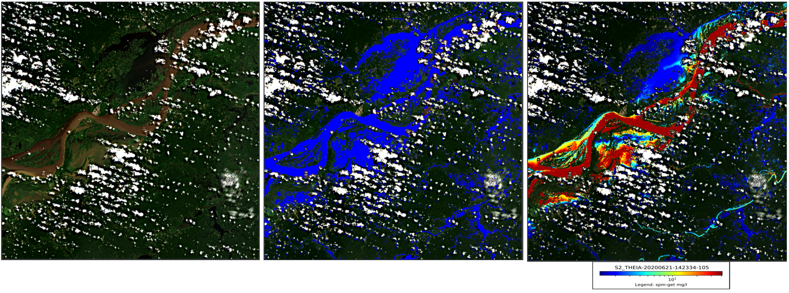

# WaterQuality

[](https://zenodo.org/badge/latestdoi/224832878)


## Synopsis

The WaterQuality package extends the functionalities of the WaterDetect[1] package (https://github.com/cordmaur/WaterDetect) to calculate continental water quality parameters from satellite reflectances. The inversion algorithms are not implemented, as they depend on the region or specifics calibration and can be found in the literature. Once the inversion function is defined, the water quality parameter is calculated just where there exist water, according to the waterdetect mask and the reports are generated. <br>

As an example, an inversion algorithms for total suspended matter (TSM), proposed by Nechad et al. (2010)[2] has been implemented. Refer to the notebook  `01_Example.ipynb` under the `nbs/` folder for more information<br>

The Medium article [Creating water quality maps from remote sensed images with Python](https://cordmaur.medium.com/creating-water-quality-maps-from-remote-sensed-images-with-python-ca5274041f4c) has the first steps on the package. 

## Dependencies
The required libraries are:
```
GDAL>=3.0.2
matplotlib>=3.1.2
PyPDF2>=1.26.0
scipy>=1.3.2
scikit-learn>=0.22
skimage>=0.16.2
numpy>=1.17
waterdetect>=1.5
```

Alternatively:
```
conda env create -f environment.yml

conda activate waterquality
```

## Instalation
The easiest way to install waterquality package is with `pip` command, directly from the git repository, like so:<br>
`pip install git+https://github.com/cordmaur/WaterQuality.git@main`

Alternatively, you can clone the repository and install from its root throught the following commands:
```
git clone https://github.com/cordmaur/WaterQuality.git
cd WaterQuality
pip install -e .
```

### Usage:
Make sure waterdetect is already installed, following the instructions in https://github.com/cordmaur/WaterDetect.

Once installed, a `waterquality` entry point is created in the path of the environment.
One can check the installation and options by running `waterquality --help`. Check also the waterdetect instalation. GDAL will be necessary for waterquality package.

```
usage: waterquality [-h] [-GC] [-i INPUT] [-o OUT] [-s SHP] [-sm] [-p PRODUCT] [-cwd CONFIG_WD] [-cwq CONFIG_WQ]

The waterquality adds a post-processing function to waterdetect package to calc water quality parameters. Waterdetect should be installed in the environment.

optional arguments:
  -h, --help            show this help message and exit
  -GC, --GetConfig      Copy the WaterQuality.ini and the WaterDetect.ini into the current directory and skips the processing. Once copied you can edit the .ini file and
                        launch the waterquality without -c option.
  -i INPUT, --input INPUT
                        The products input folder. Required.
  -o OUT, --out OUT     Output directory. Required.
  -s SHP, --shp SHP     SHP file. Optional.
  -sm, --single         Run WaterDetect over only one image instead of a directory of images. Optional.
  -p PRODUCT, --product PRODUCT
                        The product to be processed (S2_THEIA, L8_USGS, S2_L1C or S2_S2COR)
  -cwd CONFIG_WD, --config_wd CONFIG_WD
                        WaterDetect configuration file (.ini). Only needed if running WD.If not passed, WaterDetect.ini from current dir is used as default.
  -cwq CONFIG_WQ, --config_wq CONFIG_WQ
                        WaterQuality configuration file (.ini). If not passed, WaterQuality.ini from current dir is used as default.

The waterquality uses the WaterQuality.ini configuration file as well as WaterDetect.ini from waterdetect package.To copy the package's default .ini files into the current
directory, type: `waterquality -GC .` without other arguments and it will copy WaterDetect.ini and WaterQuality.ini into the current directory.The file
inversion_functions.py should be updated with the necessary inversion functions.
```

WaterQuality can be run from the console or through a notebook. For notebook usage, refer to the notebook `01_Example.ipynb` under `nbs/` folder.

The basic usage for the waterquality from the console is:<br>
`waterquality -i c:/input_folder -i -c:/output_folder -p S2_S2COR [-s any_shape.shp]`


The input directory should contain the uncompressed folders for the images. The script will loop through all folders in the input directory and save the water masks, graphs and reports to the output folder. The output folder must be created beforehand.

If the config file is not specified, the script will search for `WaterDetect.ini` and `WaterQuality.ini` in the current folder.

## Institutions
* ANA - Agência Nacional de Águas (https://www.gov.br/ana/en/)
* GET - Géosciences Environnement Toulouse (https://www.get.omp.eu/)
* IRD - Institut de Recherche pour le Développement (https://en.ird.fr/)
* CNES - Centre National d'Études Spatiales (https://cnes.fr/fr)

## License
This code is licensed under the [GNU General Public License v3.0](https://github.com/cordmaur/WaterDetect/blob/master/LICENSE) license. Please, refer to GNU's webpage  (https://www.gnu.org/licenses/gpl-3.0.en.html) for details.

## References
[1] Cordeiro, Maurício C. R., Jean-Michel Martinez, and Santiago Peña-Luque. 2021. “Automatic Water Detection from Multidimensional Hierarchical Clustering for Sentinel-2 Images and a Comparison with Level 2A Processors.” Remote Sensing of Environment 253 (February): 112209. https://doi.org/10.1016/j.rse.2020.112209.

[2] Nechad, B., K. G. Ruddick, and Y. Park. 2010. “Calibration and Validation of a Generic Multisensor Algorithm for Mapping of Total Suspended Matter in Turbid Waters.” Remote Sensing of Environment 114 (4): 854–66. https://doi.org/10.1016/j.rse.2009.11.022.
